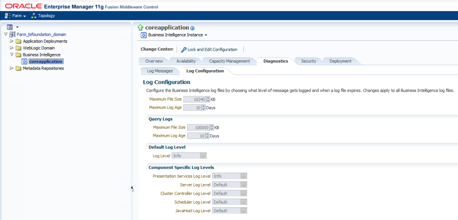

BIEE11 NQquery.log Parser
=========================

## Parser 

Файл `parse.php` выполняет парсинг BIEE11 NQquery лог файлов текстового формата, старая версия логов.

### Схема работы

Файл `parse.php` запускается как CLI утилита. Логика скрипта расчитана на запуск только один instance скрипта. Скрипт читает директорию `./download/downloaded-files` и ищет в ней файлы по шаблону: `1591321629-nqquery*.log`, где

- 1591321629 - это unixtime stamp модификации файла
- nqquery*.log - это имя файла лога, где * может присутствовать как число (обычно дата)
- эта директория наполняется файлами при помощи скрипта загрузки download-ssh.php

Так же скрипту можно передать первым параметром имя конкретного файла из этой директории, что бы скрит работал столько с этим файлом, а не со всеми файлами директории.

Если скрипт не нашел в директории файлов удовлетворяющих шаблону или переданный в параметре файл не удовлетворяет шаблону то скрипт прекращает свою работу.

Если скрипт нашел в директории один и более файлов или получил файл в параметре удовлетворяющих шаблону, то скрипт начинает парсить по очереди каждый файл, извлекать строки лога и сохранять их базу данных MSSQL в таблицу BI_NQQUERY_LOG.

В процессе парсинга скрипт выводит в консоль этапы процесса и пишет лога info и error в `./parse-errors.log`

После успешного парсинга каждого файла скрипт выполняет переименование файла в формат `0errors-65781success_1591408544-nqquery.log` где:

- 0errors - количество sql ошибок вставки данных файла в базу, если > 0, то нужно читать лог скрипта и разбираться
- 65781success - количество успешно обработанных записей из лога. Если все хорошо, то это значение равно количеству matches found в итоговом инфо по обработке файла. Количество обработанных записей и количество matches found это не количество вставленных в базу записей, а именно количество записей найденных в nqquery.log файле и обработанных скриптом, но не все их этих записей могут быть вставлены в базу данных, т.к. при обработке nqquery.log файлов нарастающим итогом (или если парсить один и тот же файл несколько раз) часто бывает ситуация когда несколько nqquery.log файлов содержат часть данных одинаковых за один и тот же период. Поэтому для каждой найденной строки в nqquery.log файле скрипт формирует на основе уникальных параметров записи лога md5 хеш, и на основе него выполняет вставку в базу данных. Поэтому уже ранее обработанные данные не попадут в базу, что бы обеспечить уникальность записей.

Скрипт предназначен работать через планировщик задач и запускаться 1 раз в сутки:

`php -f C:\your-path\NQquery\parse.php`

### Структура данных

Для сохранения в базу данных скрипт подготавливает массив, который детально прокомментирован в самом скрипте.


## Logging in Oracle BI Presentation Services

[Logging in Oracle BI Presentation Services](https://docs.oracle.com/cd/E21764_01/bi.1111/e10541/logging.htm#BIESG560)

[Understanding Diagnostic Log and Log Configuration Files](https://docs.oracle.com/cd/E21764_01/bi.1111/e10541/logging.htm#BIESG1674)

[What Are Diagnostic Log Files and Where Are They Located?](https://docs.oracle.com/cd/E21764_01/bi.1111/e10541/logging.htm#BIESG1675)

### BIEE 11 - nqquery.log

 nqquery.log на основе Oracle Business Intelligence 11.1.1.7.150120.

[Diagnostics, Logging and the OBIEE 11g EM Log Viewer](https://www.rittmanmead.com/blog/2011/03/diagnostics-logging-and-the-em-log-viewer-within-obiee-11g/) - тут подробно с картинками как посмотреть логи в web интерфейсе BI консоли.

#### Пути установки BIEE 11

- ORACLE_INSTANCE=/oracle/Middleware/instances/instance1
- OBIEE_HOME = /oracle/Middleware/

#### Расположение nqquery.log

- OBIEE_HOME/instances/instance1/diagnostics/logs/OracleBIServerComponent/coreapplication_obis1
- /oracle/Middleware/instances/instance1/diagnostics/logs/OracleBIServerComponent/coreapplication_obis1/NQQuery.log

NQQuery.log – лог запросов к BD сессий BI, более подробное представление «Управления сеансами» из административно панели BI - это как раз тот лог который открывается в интерфейсе BI по ссылке посмотреть журнал.

#### Log file rotation

[Ротация файла журнала](https://docs.oracle.com/cd/E21764_01/bi.1111/e10541/logging.htm#BIESG1682) - это создание новых файлов журнала, когда файл превышает указанный порог или дату.

Ротация файла журнала - это создание новых файлов журнала, когда файл превышает указанный порог или дату. В качестве примера возьмем параметр MaximumFileSizeKb для файла конфигурации журнала компонента для планировщика Oracle BI. Когда размер файла журнала превышает размер, заданный этим параметром, существующий файл журнала планировщика переименовывается и создается новый файл журнала. Кроме того, файла журнала, дата которого старше, чем параметр MaximumLogAgeDay, удаляется. Иными словами все файлы журнала, в том числе и переименованные, старше чем сегодня - MaximumLogAgeDay УДАЛЯЮТСЯ.



Различные компоненты Oracle BI имеют разные имена файлов журналов и разные настройки в своих файлах конфигурации журналов. Например, соглашение о присвоении имен для nqquery.log выглядит следующим образом:

- nqquery.log - последний файл журнала.
- nqquery- <n> .log - переименованный предыдущий файл журнала.
- где <n> = метка времени, например, nqquery-33.log


For more information, see Section 8.2.2.1, "[Using Fusion Middleware Control to Configure Log File Rotation Policy and Specify Log Levels.](https://docs.oracle.com/cd/E21764_01/bi.1111/e10541/logging.htm#CEGBJCDJ)"


#### Examples of the Formats of Logged Messages

[8.5.3 Examples of the Formats of Logged Messages](https://docs.oracle.com/cd/E23943_01/bi.1111/e10541/logging.htm#BIESG218)

Example 8-6 ODL-TEXT Format - The short format generates messages in a shortened form without identifying headings, such as:

```
[timestamp] [component id] [messagetype:level] [message-id] [module id] ([field-name: field-value])* message-text [[
supplemental-detail
]]
```

#### Интерпретация записей журнала

После того, как вы зарегистрировали некоторую информацию о запросе и запустили программу просмотра журнала, вы можете проанализировать журнал. Журнал разделен на несколько разделов, некоторые из которых описаны в следующем разделе. Записи журнала для уровней 1 и 2, как правило, говорят сами за себя. Записи журнала могут помочь администраторам баз данных, отвечающим за базовые базы данных, настроить их для оптимальной производительности запросов. Журнал запросов также может помочь вам проверить точность приложений, которые используют Oracle BI Server.

##### SQL Request - Logical SQL

В этом разделе перечислены SQL, выпущенные из клиентского приложения. Это может быть использовано для повторного выполнения запроса из того же приложения или из другого приложения.

##### General Query Information Общая информация о запросах

В этом разделе перечислены хранилище, бизнес-модель и каталог презентаций, из которых был выполнен запрос. Вы можете использовать эту информацию для предоставления статистики использования запросов, которая может быть использована для определения приоритетов для будущей разработки приложений и управления системой.

##### Database Query Запрос к базе данных

Этот раздел журнала начинается с записи «Отправка запроса в базу данных с именем <data_source_name>» (Sending query to database named DB_RG_SBL (id: <<31031495>>)), где data_source_name - это имя источника данных, к которому подключается сервер Oracle BI. Несколько запросов к базе данных могут быть отправлены в один или несколько источников данных. Каждый запрос будет иметь запись в журнале.

Раздел запросов к базе данных имеет несколько применений. Он записывает SQL, отправленный в базовые базы данных; Затем вы можете использовать зарегистрированный SQL для выполнения запросов непосредственно к базе данных для настройки производительности, проверки результатов или других целей тестирования. Это позволяет вам проверять таблицы, которые запрашиваются, чтобы убедиться, что совокупная навигация работает так, как вы ожидаете. Если вы понимаете структуру базовой базы данных, она также может дать некоторое представление о потенциальных улучшениях производительности, таких как полезные таблицы агрегирования или индексы для построения.

##### Query Status Статус запроса

Запись об успешном выполнении запроса в журнале указывает, успешно ли выполнен запрос или произошел сбой. Вы можете искать в журнале неудачные запросы, чтобы определить причину неудачи. Например, все запросы в течение определенного периода времени могли быть неудачными из-за простоя базы данных. Эта секция всегда присутствует.